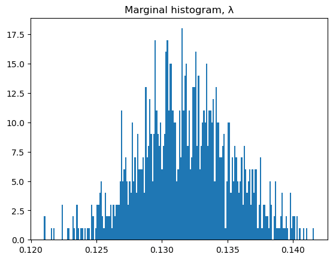

```@meta
EditURL = "../../../examples/mcmc.jl"
```

# Load packages

````julia
using Pkg
Pkg.activate(".")
Pkg.Registry.add(RegistrySpec(url = "https://github.com/RoyCCWang/RWPublicJuliaRegistry")) # where MaternRegression.jl is registered.
let
    pkgs = ["StaticArrays", "MaternRegression", "CSV", "DataFrames", "PythonPlot",
    "FiniteDiff", "SimpleUnPack", "TransformVariables", "TransformedLogDensities",
    "LogDensityProblems", "DynamicHMC"]
    for pkg in pkgs
        #check if package is in current environment.
        if Base.find_package(pkg) === nothing

            #install package.
            Pkg.add(pkg)
        end
    end
end

import Random
Random.seed!(25)

using LinearAlgebra
using Statistics
import MaternRegression as GS;
````

````
  Activating project at `~/Documents/repo/MaternRegression.jl/examples`
     Cloning registry from "https://github.com/RoyCCWang/RWPublicJuliaRegistry"
Registry `RWPublicJuliaRegistry` already exists in `~/.julia/registries/RWPublicJuliaRegistry`.

````

When we import the following, the add-on module in MaternRegression for hyperparameter inference also gets loaded.

````julia
import FiniteDiff as SFD
using SimpleUnPack
import TransformVariables as TV
import TransformedLogDensities as TD
import LogDensityProblems
import DynamicHMC as HMC;
````

for loading the data.

````julia
import CSV
import DataFrames as DF
import Dates;
````

Reset plot figures.

````julia
import PythonPlot as PLT
PLT.close("all")
fig_num = 1;
````

Specify floating-point data type.

````julia
T = Float64;
````

# Load data

Get all the data from the csv into a data frame.

````julia
function get_toronto_station()
    return "CA006158665"
end

function load_data(station_name)
    data_path = joinpath("data", "$(station_name).csv")
    return CSV.read(data_path, DF.DataFrame)
end

function reverse_standardization(yq::AbstractVector, m, s)
    return collect(s*yq[n] + m for n in eachindex(yq))
end

df_all = load_data(get_toronto_station());
````

Remove daily records that have missing maximum temperature.

````julia
df_tmax = filter(xx->!ismissing(xx.TMAX), df_all);
````

The temperature measurements needs to be divided by 10 to get Celcius units.

````julia
N = length(df_tmax.TMAX )
y0 = collect( convert(T, x/10) for x in df_tmax.TMAX );
````

`y` is the set of raining outputs.

````julia
mean_y = mean(y0)
std_y = std(y0)
y = (y0 .- mean_y) ./ std_y;
````

Convert dates to integers, and use as training inputs.

````julia
ts_dates = df_tmax.DATE
ts0 = collect( convert(T,  d |> Dates.value) for d in ts_dates );
````

Work with elapsed days as the independent variable. `ts` is the set of training inputs.

````julia
ts = ts0 .- minimum(ts0)
offset_date = ts_dates[begin];
````

# Hyperparameter inference
Specify common hyperparameters for the inverse gamma prior for `λ`, `σ²`, `b`.

````julia
α = convert(T, 1e-3)
β = convert(T, 1e-3);
````

Number of MCMC draws. Reduce `N_draws` if the inference takes too long on your computer.

````julia
N_draws = 1_000;
````

Run inference.You need to pass in the module alias `HMC` so that `MaternRegression` can check if the pre-requisite dependencies for the hyperparameter inference package extension can be loaded.

````julia
model_trait = GS.InferGain()
λ_samples, σ²_samples, b_samples, mcmc_results = GS.hp_inference(
    GS.UseDynamicHMC([SFD; SimpleUnPack; TV; TD; LogDensityProblems; HMC]),
    model_trait,
    N_draws, α, β, ts, y,
);
````

If you wish to save the results to disk, then uncomment the following:

````julia
##Save to disk, for later use with the QMD file.
#using Serialization
#serialize("results/mcmc", (λ_samples, σ²_samples, b_samples, mcmc_results));
````

To load results from disk, uncomment the following:

````julia
##Load from disk, make sure there were no errors in loading.
#using Serialization
#λ_samples, σ²_samples, b_samples, mcmc_results = deserialize("results/mcmc");
````

The marginal empirical mean and variance of the drawn samples.

````julia
λ_m, λ_v = mean(λ_samples), var(λ_samples)
σ²_m, σ²_v = mean(σ²_samples), var(σ²_samples)
b_m, b_v = mean(b_samples), var(b_samples);
````

Check out the Hamiltonian Monte Carlo diagnostics.

````julia
HMC.Diagnostics.summarize_tree_statistics(mcmc_results.tree_statistics)
````

````
Hamiltonian Monte Carlo sample of length 1000
  acceptance rate mean: 0.93, 5/25/50/75/95%: 0.72 0.9 0.97 0.99 1.0
  termination: divergence => 0%, max_depth => 0%, turning => 100%
  depth: 0 => 0%, 1 => 2%, 2 => 40%, 3 => 47%, 4 => 11%
````

## Marginal Histograms

````julia
nbins = 200
````

````
200
````

The marginal `λ` samples.

````julia
PLT.figure(fig_num)
fig_num += 1
PLT.hist(λ_samples, nbins)
PLT.title("Marginal histogram, λ")
PLT.show() #Not needed if run in the Julia REPL.
PLT.gcf() #required for Literate.jl
````


The marginal `σ²` samples.

````julia
PLT.figure(fig_num)
fig_num += 1
PLT.hist(σ²_samples, nbins)
PLT.title("Marginal histogram, σ²")
PLT.show() #Not needed if run in the Julia REPL.
PLT.gcf() #required for Literate.jl
````


The marginal `b` samples.

````julia
PLT.figure(fig_num)
fig_num += 1
PLT.hist(b_samples, nbins)
PLT.title("Marginal histogram, b")
PLT.show() #Not needed if run in the Julia REPL.
PLT.gcf() #required for Literate.jl
````


# Query inferred model
We now draw samples from an ensemble of GPR models, each GPR model corresponds to a drawn hyperparameter sample from the hyperparameter inference.

Reset seed for reproducibility.

````julia
Random.seed!(25)
````

````
Random.TaskLocalRNG()
````

Choose `5000` uniformly spaced time stamps across the in-fill interval, then pick the first `window_len` of them as the query positions.

````julia
Nq = 5000
window_len = 50
tqs = LinRange(ts[begin], ts[end], Nq)[1:window_len];
````

We'll draw `M` number of samples per GPR model.

````julia
M = 1_000
query_samples = GS.simulate_sdegps(
    λ_samples, σ²_samples, b_samples, M, ts, tqs, y,
);
````

If you wish to save the results to disk, then uncomment the following:

````julia
##Save to disk, for later use with the QMD file.
#using Serialization
#serialize("results/mcmc_query", query_samples)
````

To load results from disk, uncomment the following:

````julia
##Load from disk, make sure there were no errors in loading.
#using Serialization
#query_samples = deserialize("results/mcmc_query")
````

Separate into predictive means `mqs` and variances `vqs`.

````julia
mqs, vqs = GS.compute_mean_var(query_samples);
````

Get the preditive standard deviation.

````julia
sqs = sqrt.(vqs);
````

prepare for display.

````julia
inds = findall(xx->xx<tqs[end], ts)
ts_display = ts[inds]
y_display = reverse_standardization(y[inds], mean_y, std_y)

mqs = reverse_standardization(mqs, mean_y, std_y)
sqs = sqs .* std_y;
````

Set the shaded region to be 3 standard deviations from the mean.

````julia
plot_uq_amount = 3 .* sqs;
````

Visualize.

````julia
fig_size = (6, 4) # units are in inches.
dpi = 300

PLT.figure(fig_num; figsize = fig_size, dpi = dpi)
fig_num += 1

PLT.scatter(ts_display, y_display, s = 20, label = "Data")
PLT.plot(tqs, mqs, label = "Predictive mean")

PLT.fill_between(
    tqs,
    mqs - plot_uq_amount,
    mqs + plot_uq_amount,
    alpha = 0.3,
    label = "3 standard deviations"
)

PLT.xlabel("Days elapsed since $offset_date", fontsize = 12)
PLT.ylabel("Temperature (Celcius)", fontsize = 12)
PLT.legend()
PLT.show() #Not needed if run in the Julia REPL.
PLT.gcf() #required for Literate.jl
````


---

*This page was generated using [Literate.jl](https://github.com/fredrikekre/Literate.jl).*

