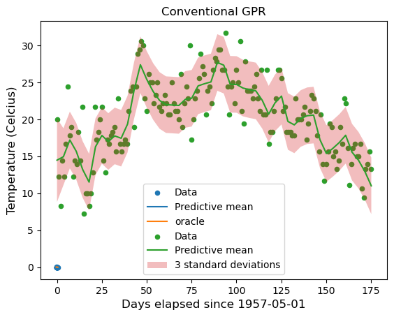

```@meta
EditURL = "../../../examples/optim.jl"
```

# Load packages

````julia
using Pkg
Pkg.activate(".")
Pkg.Registry.add(RegistrySpec(url = "https://github.com/RoyCCWang/RWPublicJuliaRegistry")) # where MaternRegression.jl is registered.
let
    pkgs = ["StaticArrays", "MaternRegression", "CSV", "DataFrames", "PythonPlot",
    ]
    for pkg in pkgs
        #check if package is in current environment.
        if Base.find_package(pkg) === nothing

            #install package.
            Pkg.add(pkg)
        end
    end
end

import Random
Random.seed!(25)

using LinearAlgebra
using Statistics
import MaternRegression as GS;
````

````
  Activating project at `~/Documents/repo/MaternRegression.jl/examples`
     Cloning registry from "https://github.com/RoyCCWang/RWPublicJuliaRegistry"
Registry `RWPublicJuliaRegistry` already exists in `~/.julia/registries/RWPublicJuliaRegistry`.

````

When we import `Metaheuristics`, the add-on module in MaternRegression for hyperparameter optimization also gets loaded.

````julia
import Metaheuristics as EVO;
````

for loading the data.

````julia
import CSV
import DataFrames as DF
import Dates;
````

Reset plot figures.

````julia
import PythonPlot as PLT
fig_num = 1;
````

Specify floating-point data type.

````julia
T = Float64;
````

# Load data

Get all the data from the csv into a data frame.

````julia
function get_toronto_station()
    return "CA006158665"
end

function load_data(station_name)
    data_path = joinpath("data", "$(station_name).csv")
    return CSV.read(data_path, DF.DataFrame)
end

function reverse_standardization(yq::AbstractVector, m, s)
    return collect(s*yq[n] + m for n in eachindex(yq))
end

df_all = load_data(get_toronto_station());
````

Remove daily records that have missing maximum temperature.

````julia
df_tmax = filter(xx->!ismissing(xx.TMAX), df_all);
````

The temperature measurements needs to be divided by 10 to get Celcius units.

````julia
N = length(df_tmax.TMAX )
y0 = collect( convert(T, x/10) for x in df_tmax.TMAX );
````

`y` is the set of raining outputs.

````julia
mean_y = mean(y0)
std_y = std(y0)
y = (y0 .- mean_y) ./ std_y;
````

Convert dates to integers, and use as training inputs.

````julia
ts_dates = df_tmax.DATE
ts0 = collect( convert(T,  d |> Dates.value) for d in ts_dates );
````

Work with elapsed days as the independent variable. `ts` is the set of training inputs.

````julia
ts = ts0 .- minimum(ts0)
offset_date = ts_dates[begin];
````

# Hyperparameter optimization
The optimization algorithm tries not to exceed this number of marginal likelihood evaluations:

````julia
f_calls_limit = 10_000;
````

`GS.InferGain() ` constructs a [dispatch data type](https://docs.julialang.org/en/v1/manual/methods/#Trait-based-dispatch) that tells the algorithm that the variable ordering is: [λ, σ², b]

````julia
trait = GS.InferGain();
````

These are the optimization variable lower and upper bounds, respectively.

````julia
optim_lbs = convert(Vector{T}, [1e-5; 1e-5; 1e-5])
optim_ubs = convert(Vector{T}, [1.0; 1.0; 1.0]);
````

Solve the hyperparameter optimization problem. You need to pass in the module alias `EVO` so that `MaternRegression` can check if the pre-requisite dependencies for the hyperparameter optimization package extension can be loaded.

````julia
evo_sol_vars, evo_sol_cost = GS.hp_optim(
    GS.UseMetaheuristics(EVO),
    trait,
    ts, y, optim_lbs, optim_ubs;
    f_calls_limit = f_calls_limit,
    #p0s = initial_guesses, #include initial guesses here. These should be of type `Vector{Vector{T}}`.
);
````

To load results from disk, uncomment the following:

````julia
##Save to disk, for later use with the QMD file.
#using Serialization
#serialize("results/optim", (evo_sol_vars, evo_sol_cost));
````

To load results from disk, uncomment the following:

````julia
##Load from disk, make sure there were no errors in loading.
#evo_sol_vars, evo_sol_cost = deserialize("results/optim");
````

# Query and visualize
Choose `5000` uniformly spaced time stamps across the in-fill interval, then pick the first `window_len` of them as the query positions.

````julia
Nq = 5000
window_len = 50
tqs = LinRange(minimum(ts), maximum(ts), Nq)[1:window_len];
````

Parse the hyperparameter optimization results to a Matern kernel, `θ_sde_query`, and the observation variance, `σ²`.

````julia
θ_sde_query, σ² = GS.parse_ml_result(trait, evo_sol_vars);
````

Run GPR predictive inference to get predictive means `mqs` and predictive variances `vqs`.

````julia
sde_gp = GS.create_sdegp(θ_sde_query, ts, y, σ²) # cached phase.
mqs, vqs = GS.query_sdegp(T, sde_gp, tqs, ts); # query phase.
````

The preditive standard deviation.

````julia
sqs = sqrt.(vqs);
````

prepare for display.

````julia
inds = findall(xx->xx<tqs[window_len], ts)
ts_display = ts[inds]
y_display = reverse_standardization(y[inds], mean_y, std_y)

mqs = reverse_standardization(mqs, mean_y, std_y)
sqs = sqs .* std_y;
````

Set the shaded region to be 3 standard deviations from the mean.

````julia
plot_uq_amount = 3 .* sqs;
````

Visualize.

````julia
fig_size = (6, 4) # units are in inches.
dpi = 300

PLT.figure(fig_num; figsize = fig_size, dpi = dpi)
fig_num += 1

PLT.scatter(ts_display, y_display, s = 20, label = "Data")
PLT.plot(tqs, mqs, label = "Predictive mean")

PLT.fill_between(
    tqs,
    mqs - plot_uq_amount,
    mqs + plot_uq_amount,
    alpha = 0.3,
    label = "3 standard deviations"
)

PLT.xlabel("Days elapsed since $offset_date", fontsize = 12)
PLT.ylabel("Temperature (Celcius)", fontsize = 12)
PLT.legend()
PLT.show() #Not needed if run in the Julia REPL.
PLT.gcf() #Required for Literate.jl
````


---

*This page was generated using [Literate.jl](https://github.com/fredrikekre/Literate.jl).*

