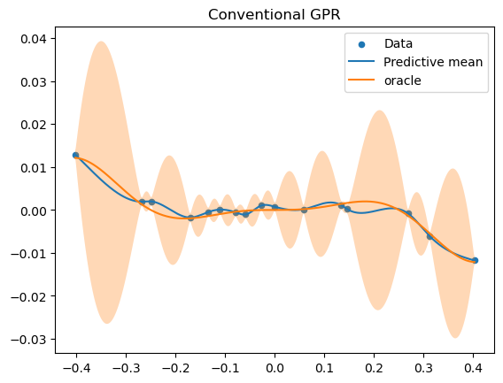

```@meta
EditURL = "../../../examples/sde_gp.jl"
```

# Load packages

````julia
using Pkg
Pkg.activate(".")
Pkg.Registry.add(RegistrySpec(url = "https://github.com/RoyCCWang/RWPublicJuliaRegistry")) # where MaternRegression.jl is registered.
let
    pkgs = ["RKHSRegularization", "StaticArrays", "MaternRegression", "PythonPlot",
    ]
    for pkg in pkgs
        #check if package is in current environment.
        if Base.find_package(pkg) === nothing

            #install package.
            Pkg.add(pkg)
        end
    end
end

import Random
Random.seed!(25)

using LinearAlgebra
using Statistics
import RKHSRegularization as RK
import MaternRegression as GS;

include("helpers/gpr.jl")
include("helpers/utils.jl");
````

````
  Activating project at `~/Documents/repo/MaternRegression.jl/examples`
     Cloning registry from "https://github.com/RoyCCWang/RWPublicJuliaRegistry"
Registry `RWPublicJuliaRegistry` already exists in `~/.julia/registries/RWPublicJuliaRegistry`.

````

Reset plot figures.

````julia
import PythonPlot as PLT
PLT.close("all")
fig_num = 1;
````

````
    CondaPkg Found dependencies: /home/roy/.julia/packages/PythonCall/bb3ax/CondaPkg.toml
    CondaPkg Found dependencies: /home/roy/.julia/packages/PythonPlot/KcWMF/CondaPkg.toml
    CondaPkg Dependencies already up to date

````

Specify floating-point data type.

````julia
T = Float64;
````

# Oracle model set up
Specify the Matern 3/2 covariance function hyperparameters.

````julia
λ = convert(T, 1.23)
b = convert(T, 5.6)
q_Matern32 = 4*b*λ^3
θ = RK.Matern3Halfs(λ, b);
````

Specify observation variance. Set this to a very small number like 1e-12 for a noise-less regression.

````julia
σ² = convert(T, 1e-6);
````

Set up oracle, `f`.

````julia
N_on_grid = 7
N_randomly_generated = 9
ub = abs(randn(T))
lb = -ub
ts = generate_almost_grid(N_on_grid, N_randomly_generated, lb, ub)

f = xx->sinc(4*xx)*xx^3
y = collect(
  f(t) + randn(T) * sqrt(σ²)
  for t in ts
);
````

# Query

````julia
Nq = 1000
tqs = LinRange(lb, ub, Nq);
````

Oracle query.

````julia
f_xq = f.(tqs);
````

Fit and query the GPR via RHKSRegularization.jl, which uses a conventional implementation without Bayesian filtering.

````julia
mqs, vqs, η = querygpr(θ, tqs, ts, y, σ²) #predictive mean, prod. variance, GPR model container.
sqs = sqrt.(vqs); #preditive standard deviation
````

Visualize the oracle and (conventional implementation) GPR query results

````julia
PLT.figure(fig_num)
fig_num += 1

PLT.scatter(ts, y, s = 20, label = "Data")
PLT.plot(tqs, mqs, label = "Predictive mean")

PLT.plot(tqs, f_xq, label = "oracle")
PLT.fill_between(tqs, mqs - sqs, mqs + sqs, alpha = 0.3)

PLT.title("Conventional GPR")
PLT.legend()
PLT.show() #Not needed if running from a Julia REPL.
PLT.gcf() #Required for Literate.jl
````


# Query Comparison
Conventional implementation of univariate Matern 3/2 GPRs for in-fill problems compared against the stochastic differential equation (SDE) / Bayesian filtering implementation:
Set the query positions to be a uniformly spaced grid of `Nq` samples.

````julia
Nq = 5_000
tqs = LinRange(lb, ub, Nq);
````

Conventional GPR.

````julia
θ = RK.Matern3Halfs(λ, b) #covariance function variable from `RKHSRegularization.jl`.
mqs, vqs, η = querygpr(θ, tqs, ts, y, σ²);
````

SDE GPR.

````julia
θ_sde = GS.create_Matern3HalfsKernel(λ, b) #covariance function variable.
sde_gp = GS.create_sdegp(θ_sde, ts, y, σ²) #cache phase.
mqs2, vqs2 = GS.query_sdegp(T, sde_gp, tqs, ts); #query phase.
````

Relative discrepancy

````julia
@show norm(mqs - mqs2)/norm(mqs2)
@show norm(vqs - vqs2)/norm(vqs2)
````

````
7.031627432571349e-12
````

Marginal likelihood: conventional GPR implementation:

````julia
ML_gpr = evalnlli_gpr(η, y)
````

````
90.39341339598067
````

Marginal likelihood: SDE/Bayesian filtering implementation:

````julia
θ_dummy = GS.create_Matern3HalfsKernel(T)
ML_buffer = GS.setup_ml(θ_dummy, ts, y)
ML_sde = GS.eval_ml!(ML_buffer, θ_sde, ts, y, σ²)
````

````
90.39341339607462
````

---

*This page was generated using [Literate.jl](https://github.com/fredrikekre/Literate.jl).*

